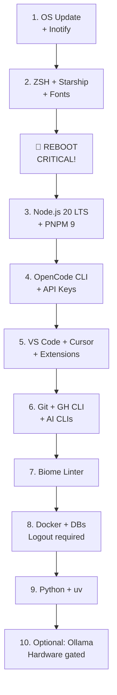

# Pop!_OS 24.04 LTS — Setup Guide for AI-Assisted Software Engineers

> A 2026 evolution of [erik1066/pop-os-setup](https://github.com/erik1066/pop-os-setup),
> updated for Pop!_OS 24.04 LTS with COSMIC Desktop.
> Focused on AI-assisted software engineering workflows.
>
> Created with human-AI collaboration — see [Credits](#credits).

## Who is this for?

Software engineers who want a professional, productive, AI-first development
environment on Pop!_OS 24.04 LTS. Not a beginner guide — assumes clean install.

## Quick Start: Automated Installation

### Option A: Master Installer (Recommended)

```bash
# Clone the repo
git clone https://github.com/elkin500/pop-os-ai-dev-setup
cd pop-os-ai-dev-setup

# Run diagnostic first to check current state
bash scripts/diagnostic.sh

# Run master installer (interactive, guides through all steps)
bash scripts/install-all.sh
```

### Option B: Step-by-Step Scripts

```bash
# Phase 1: Base system + Shell (REQUIRES REBOOT!)
bash scripts/install-base.sh
# ⚠️ REBOOT NOW before continuing!

# Phase 2: Node.js + PNPM (after ZSH is active)
bash scripts/install-node.sh

# Phase 3: OpenCode + API Keys
bash scripts/install-opencode.sh
# Edit ~/.config/ai-keys/exports.sh with your keys
source ~/.zshrc

# Phase 4: Tools (IDEs, Git, GH CLI, Biome)
bash scripts/install-tools.sh

# Phase 5: Docker + Databases
bash scripts/install-docker.sh
# Logout/login for docker group

# Phase 6: Python + uv
bash scripts/install-python.sh

# Phase 7: Optional (Ollama, Security, Apps)
bash scripts/install-optional.sh
```

---

## Installation Order (Critical!)

> **⚠️ The order matters!** Dependencies must be satisfied before each step.



### Why this order?

| Step | Depends On | Why |
|------|------------|-----|
| OpenCode (4) | Node.js (3) | `npm install -g` requires Node |
| API Keys (4) | ZSH active (2) | Keys loaded from ~/.zshrc |
| NVM (3) | ZSH + Reboot (2) | NVM needs shell config loaded |
| Docker group (8) | Logout/login | Group membership needs session refresh |

---

## Installation Checklist

Use this checklist to track progress:

### Phase 1: Base System
- [ ] 1. OS Update (`sudo apt full-upgrade`)
- [ ] 2. Inotify max watches (524288)
- [ ] 3. ZSH + Oh My Zsh + Starship
- [ ] 4. Nerd Fonts (JetBrainsMono)
- [ ] 5. Kitty terminal (optional)
- [ ] 6. COSMIC Desktop config
- [ ] 🔴 **REBOOT NOW** — Shell change requires logout!

### Phase 2: Runtime + AI Tools
- [ ] 10. Node.js 20 LTS (via NVM)
- [ ] PNPM 9
- [ ] 9. OpenCode CLI
- [ ] API keys configured (`~/.config/ai-keys/exports.sh`)
- [ ] OpenCode config (`~/.config/opencode/config.json`)

### Phase 3: Editors + Tools
- [ ] 7. VS Code + AI extensions
- [ ] 8. Cursor IDE (AppImage)
- [ ] 11. Git + SSH keys
- [ ] 12. GitHub CLI + Copilot
- [ ] 13. Claude CLI + Gemini CLI
- [ ] 14. Biome (linter/formatter)

### Phase 4: Infrastructure
- [ ] 15. Docker + docker group
- [ ] 16. PostgreSQL + Redis (Docker Compose)
- [ ] Logout/login for docker group
- [ ] 17. Python 3 + uv

### Phase 5: Optional
- [ ] 18. Ollama (if hardware supports)
- [ ] 19. UFW firewall + Bitwarden CLI
- [ ] 20. Apps: Slack, Bruno, Obsidian
- [ ] 21. Runtimes: Go, Rust, Bun (if needed)

---

## ⚠️ Hardware Note: NVIDIA Pascal (GTX 10xx)

COSMIC uses Wayland exclusively. NVIDIA Pascal-generation GPUs (GTX 10xx)
have **known issues** with Wayland compositing in 24.04.
If you have a GTX 10xx card, verify compatibility before upgrading:
https://github.com/pop-os/pop/issues

---

## Detailed Steps

<details>
<summary><b>1. Update the OS</b></summary>

**current as of 2026-05**

Primer paso post-instalación. Pop!_OS 24.04 usa `apt` como gestor base
igual que versiones anteriores. El comando `full-upgrade` es preferido
over `upgrade` para manejar correctamente dependencias.

```bash
sudo apt update && sudo apt full-upgrade -y
sudo apt install -y build-essential curl wget git zip unzip htop gnupg ca-certificates lsb-release apt-transport-https software-properties-common
```

Run `lsb_release -a` and look for `Description: Pop!_OS 24.04 LTS` to verify.

</details>

<details>
<summary><b>2. Increase the inotify watch count</b></summary>

**current as of 2026-05** | Crítico para dev con Node/Vite/esbuild

Vite, esbuild, TypeScript compiler y OpenCode CLI usan file watchers
intensivamente. El límite por defecto de Linux (8192) genera errores
ENOSPC durante el desarrollo.

```bash
echo fs.inotify.max_user_watches=524288 | sudo tee /etc/sysctl.d/40-inotify.conf
sudo sysctl -p --system
```

Run `cat /proc/sys/fs/inotify/max_user_watches` and look for `524288`.

</details>

<details>
<summary><b>3. Shell: ZSH + Starship Prompt</b></summary>

**current as of 2026-05** | Reemplaza el setup ZSH + tema del original

ZSH como shell principal. Starship reemplaza los temas de Oh-My-ZSH:
es más rápido, escrito en Rust, y muestra contexto de Node, Git, y
directorio activo sin configuración extra. Ideal para flujos AI-dev.

```bash
# Install ZSH
sudo apt install -y zsh

# Set as default shell
chsh -s $(which zsh)

# Install Oh-My-ZSH
sh -c "$(curl -fsSL https://raw.githubusercontent.com/ohmyzsh/ohmyzsh/master/tools/install.sh)" "" --unattended

# Install Starship prompt
curl -sS https://starship.rs/install.sh | sh

# Add Starship to ~/.zshrc
echo 'eval "$(starship init zsh)"' >> ~/.zshrc

# Install useful plugins
git clone https://github.com/zsh-users/zsh-autosuggestions ${ZSH_CUSTOM:-~/.oh-my-zsh/custom}/plugins/zsh-autosuggestions
git clone https://github.com/zsh-users/zsh-syntax-highlighting ${ZSH_CUSTOM:-~/.oh-my-zsh/custom}/plugins/zsh-syntax-highlighting
```

Edit `~/.zshrc` and update plugins line:

```
plugins=(git zsh-autosuggestions zsh-syntax-highlighting node)
```

Run `starship --version` and look for `starship 1.x.x` to verify.
Restart terminal and verify prompt with colors and Git context active.

> **⚠️ REBOOT NOW after this step!** The `chsh` command requires logout/login to activate ZSH.

</details>

<details>
<summary><b>4. Terminal: Kitty (GPU-accelerated alternative)</b></summary>

**current as of 2026-05**

COSMIC Terminal comes preinstalled in 24.04 and is the default option.
Kitty is a GPU-accelerated alternative recommended for long outputs
from AI tools (Claude/Gemini CLI streams).

```bash
sudo apt install -y kitty
```

To set Kitty as default terminal:

```bash
sudo update-alternatives --install /usr/bin/x-terminal-emulator x-terminal-emulator $(which kitty) 50
sudo update-alternatives --config x-terminal-emulator
```

Run `kitty --version` and look for `kitty 0.3x.x` to verify.

> Note: COSMIC Terminal is excellent for daily use. Kitty is optional
> but superior for long scrollback of AI model outputs.

</details>

<details>
<summary><b>5. Nerd Fonts</b></summary>

**current as of 2026-05** | Required for Starship + icons in AI editors

JetBrains Mono Nerd Font is the standard for IDEs with AI integration
in 2026. Required for Starship and VS Code/Cursor to show icons
correctly.

```bash
# Create local fonts directory
mkdir -p ~/.local/share/fonts

# Download JetBrains Mono Nerd Font
wget -O /tmp/JetBrainsMono.zip https://github.com/ryanoasis/nerd-fonts/releases/latest/download/JetBrainsMono.zip

# Install
unzip /tmp/JetBrainsMono.zip -d ~/.local/share/fonts/JetBrainsMono
fc-cache -fv
```

Run `fc-list | grep "JetBrains"` and look for at least one `JetBrainsMono` entry.

</details>

<details>
<summary><b>6. COSMIC Desktop: Appearance & Professional Config</b></summary>

**current as of 2026-05** | [NEW] Replaces GNOME Tweaks + Extensions section

COSMIC Desktop (Pop!_OS 24.04) is Wayland-only with native window tiling
(`Super + G`). No GNOME extensions needed. Customization done from
**COSMIC Settings → Desktop → Appearance**.

### Native Tiling (replaces Pop Shell)

- `Super + G` — toggle tiling for current window
- `Super + Direction` — move focus between windows
- `Super + Shift + Direction` — move window
- `Super + Enter` — new window in split

### Catppuccin GTK Theme

> **⚠️ Note: Catppuccin GTK is ARCHIVED** (Jun 2, 2024)
> The repository is no longer maintained but releases are still available.
> See: https://github.com/catppuccin/gtk

```bash
# Create theme directories
mkdir -p ~/.local/share/themes
mkdir -p ~/.local/share/icons

# Download latest available release (v1.0.3)
wget -O /tmp/catppuccin-gtk.zip \
  "https://github.com/catppuccin/gtk/releases/download/v1.0.3/catppuccin-mocha-mauve-standard+default.zip"
unzip /tmp/catppuccin-gtk.zip -d ~/.local/share/themes/
```

### Papirus Icons

```bash
sudo add-apt-repository -y ppa:papirus/papirus
sudo apt update
sudo apt install -y papirus-icon-theme
```

Apply from: **COSMIC Settings → Desktop → Appearance → Icons**

> Note: GNOME Tweaks does NOT exist in COSMIC. All customization is
> from COSMIC Settings or copying files to ~/.local/share/themes.

</details>

<details>
<summary><b>10. Node.js 20 LTS + PNPM 9</b> — MUST be installed BEFORE OpenCode!</summary>

**current as of 2026-05** | Production-validated versions

Node 20 LTS via NVM to manage multiple versions. PNPM 9 as package manager:
faster than npm, better monorepo handling, growing standard in modern
TypeScript projects.

> **⚠️ This step MUST run AFTER reboot** (when ZSH is active)

```bash
# Install NVM
curl -o- https://raw.githubusercontent.com/nvm-sh/nvm/master/install.sh | bash

# Load NVM without restarting terminal
export NVM_DIR="$HOME/.nvm"
[ -s "$NVM_DIR/nvm.sh" ] && \. "$NVM_DIR/nvm.sh"

# Install Node 20 LTS
nvm install 20
nvm use 20
nvm alias default 20

# Install PNPM 9
npm install -g pnpm@9

# Configure PNPM
pnpm setup
```

Run `node --version` and look for `v20.x.x` to verify.
Run `pnpm --version` and look for `9.x.x` to verify.

</details>

<details>
<summary><b>9. OpenCode CLI</b></summary>

**current as of 2026-05** | [NEW] AI code agent in terminal

OpenCode is a coding agent that runs in terminal, similar to
Claude Code or Gemini CLI but configurable with multiple providers
and MCPs (Model Context Protocol). Essential for AI-first workflows.

> **⚠️ Requires Node.js first!** Run step 10 before this.

```bash
# Verify package name before installing:
npm info opencode

# Installation:
npm install -g opencode
```

> Package name may vary. Check https://opencode.ai/docs for latest instructions.

### Provider Configuration

Create `~/.config/opencode/config.json`:

```json
{
  "providers": {
    "anthropic": {
      "apiKey": "${ANTHROPIC_API_KEY}"
    },
    "google": {
      "apiKey": "${GOOGLE_AI_API_KEY}"
    }
  },
  "model": "claude-sonnet-4-5",
  "fallback": "gemini-2.0-flash"
}
```

### Secure API Key Management

```bash
# Create secure keys directory (outside any repo)
mkdir -p ~/.config/ai-keys
chmod 700 ~/.config/ai-keys

# Create variables file
cat > ~/.config/ai-keys/exports.sh << 'EOF'
export ANTHROPIC_API_KEY="sk-ant-..."
export GOOGLE_AI_API_KEY="AIza..."
export OPENAI_API_KEY="sk-..."
EOF

chmod 600 ~/.config/ai-keys/exports.sh

# Auto-load in each session
echo 'source ~/.config/ai-keys/exports.sh' >> ~/.zshrc
```

Run `opencode --version` and look for a version number to verify.

</details>

<details>
<summary><b>7. Visual Studio Code</b></summary>

**current as of 2026-05**

Install from official Microsoft repository for automatic updates.

```bash
wget -qO- https://packages.microsoft.com/keys/microsoft.asc | gpg --dearmor | sudo tee /etc/apt/trusted.gpg.d/microsoft.gpg > /dev/null

echo "deb [arch=amd64] https://packages.microsoft.com/repos/code stable main" | sudo tee /etc/apt/sources.list.d/vscode.list

sudo apt update && sudo apt install -y code
```

### Required AI Extensions (CLI install)

```bash
code --install-extension GitHub.copilot
code --install-extension GitHub.copilot-chat
code --install-extension Continue.continue
code --install-extension biomejs.biome
code --install-extension usernamehw.errorlens
code --install-extension eamodio.gitlens
code --install-extension humao.rest-client
```

### Minimal Recommended Settings (~/.config/Code/User/settings.json)

```json
{
  "editor.fontFamily": "'JetBrainsMono Nerd Font', monospace",
  "editor.fontSize": 14,
  "editor.fontLigatures": true,
  "editor.formatOnSave": true,
  "editor.defaultFormatter": "biomejs.biome",
  "terminal.integrated.fontFamily": "'JetBrainsMono Nerd Font Mono'",
  "editor.inlineSuggest.enabled": true,
  "github.copilot.enable": { "*": true }
}
```

Run `code --version` and look for `1.9x.x` (or newer) to verify.

</details>

<details>
<summary><b>8. Cursor IDE</b></summary>

**current as of 2026-05** | [NEW] AI-first IDE, VS Code fork

Cursor is the most complete AI IDE in 2026: native AI integrated
into editor, not as extension. Allows chat with full codebase,
multi-file AI-guided editing, and MCP support.

```bash
# Download official AppImage
mkdir -p ~/Applications
wget -O ~/Applications/cursor.AppImage "https://downloader.cursor.sh/linux/appImage/x64"
chmod +x ~/Applications/cursor.AppImage

# Create .desktop launcher for COSMIC
cat > ~/.local/share/applications/cursor.desktop << 'EOF'
[Desktop Entry]
Name=Cursor
Exec=/home/$USER/Applications/cursor.AppImage --no-sandbox
Icon=cursor
Type=Application
Categories=Development;TextEditor;
EOF

update-desktop-database ~/.local/share/applications/
```

> Cursor has no official .deb package. AppImage is the installation
> method on Linux. The .desktop launcher integrates it to COSMIC Launcher.

Run `~/Applications/cursor.AppImage --version` and look for a version string.

</details>

<details>
<summary><b>11. Git Configuration</b></summary>

**current as of 2026-05**

Global Git config with GPG signing and SSH keys. Commit signing is
especially important in human-AI collaboration projects to maintain
authorship traceability.

```bash
git config --global user.name "Your Name"
git config --global user.email "your@email.com"
git config --global core.editor "code --wait"
git config --global init.defaultBranch main
git config --global pull.rebase false

# Generate SSH key (Ed25519 — recommended algorithm 2026)
ssh-keygen -t ed25519 -C "your@email.com"

# Start ssh-agent and add key
eval "$(ssh-agent -s)"
ssh-add ~/.ssh/id_ed25519

# Copy public key to add to GitHub
cat ~/.ssh/id_ed25519.pub
```

Run `git config --list` and look for `user.name` and `user.email` to verify.

</details>

<details>
<summary><b>12. GitHub CLI</b></summary>

**current as of 2026-05**

`gh` CLI for repo management, PRs, and AI model access from terminal.
`gh copilot` allows asking questions and command suggestions directly.

```bash
# Add official GitHub CLI repository
(type -p wget >/dev/null || (sudo apt update && sudo apt-get install wget -y)) \
  && sudo mkdir -p -m 755 /etc/apt/keyrings \
  && out=$(mktemp) && wget -nv -O$out https://cli.github.com/packages/githubcli-archive-keyring.gpg \
  && cat $out | sudo tee /etc/apt/keyrings/githubcli-archive-keyring.gpg > /dev/null \
  && sudo chmod go+r /etc/apt/keyrings/githubcli-archive-keyring.gpg \
  && echo "deb [arch=$(dpkg --print-architecture) signed-by=/etc/apt/keyrings/githubcli-archive-keyring.gpg] https://cli.github.com/packages stable main" \
  | sudo tee /etc/apt/sources.list.d/github-cli.list > /dev/null \
  && sudo apt update \
  && sudo apt install gh -y

# Authenticate
gh auth login

# Install Copilot CLI extension
gh extension install github/gh-copilot
```

Useful commands:

```bash
gh copilot suggest "how to list ports in use"  # command suggestion
gh copilot explain "sudo ss -tulnp"             # explain a command
```

Run `gh --version` and look for `gh version 2.x.x` to verify.

</details>

<details>
<summary><b>13. AI Cloud CLI Tools</b></summary>

**current as of 2026-05** | [NEW] Mandatory AI cloud tools

In 2026, these three CLIs are part of the standard toolkit for
AI-assisted engineers. They complement each other: Claude for complex code,
Gemini for long contexts, GitHub Copilot for terminal workflow.

```bash
# Claude CLI (Anthropic)
npm install -g @anthropic-ai/claude-code

# Gemini CLI (Google)
npm install -g @google/gemini-cli

# Verify API keys loaded (configured in OpenCode section)
echo "ANTHROPIC: ${ANTHROPIC_API_KEY:0:10}..."
echo "GOOGLE: ${GOOGLE_AI_API_KEY:0:10}..."
```

Run `claude --version` and `gemini --version` to verify.

</details>

<details>
<summary><b>14. Biome — Unified Linter and Formatter</b></summary>

**current as of 2026-05** | [NEW] Replaces ESLint + Prettier

Biome is the all-in-one linter/formatter for TypeScript ecosystem 2026.
10-20x faster than ESLint+Prettier, written in Rust. Single config file
for entire project.

```bash
# Install globally
npm install -g @biomejs/biome

# Verify
biome --version
```

### Base Config (biome.json in project root)

```json
{
  "$schema": "https://biomejs.dev/schemas/1.9.4/schema.json",
  "organizeImports": { "enabled": true },
  "linter": {
    "enabled": true,
    "rules": { "recommended": true }
  },
  "formatter": {
    "enabled": true,
    "indentStyle": "space",
    "indentWidth": 2
  }
}
```

Run `biome --version` and look for `Version: 1.x.x` to verify.

</details>

<details>
<summary><b>15. Docker</b></summary>

**current as of 2026-05**

Docker for development containers and local databases.
Install from official Docker repository (not the outdated `docker.io` apt package).

```bash
# Remove old versions if present
sudo apt remove -y docker docker-engine docker.io containerd runc 2>/dev/null || true

# Add official Docker repository
curl -fsSL https://download.docker.com/linux/ubuntu/gpg | sudo gpg --dearmor -o /etc/apt/trusted.gpg.d/docker.gpg

echo "deb [arch=amd64] https://download.docker.com/linux/ubuntu $(lsb_release -cs) stable" | sudo tee /etc/apt/sources.list.d/docker.list

sudo apt update
sudo apt install -y docker-ce docker-ce-cli containerd.io docker-compose-plugin

# Add user to docker group (no sudo)
sudo usermod -aG docker $USER
newgrp docker
```

Run `docker --version` and look for `Docker version 27.x` or newer.
Run `docker compose version` and look for `Docker Compose version v2.x` to verify.

> **⚠️ Logout/login required** for docker group membership to take effect.

</details>

<details>
<summary><b>16. Databases in Docker (PostgreSQL + Redis)</b></summary>

**current as of 2026-05**

Databases via Docker Compose for local development. This pattern
avoids installing PostgreSQL directly and allows multiple versions per project.

Create `~/dev/docker-compose.dev.yml`:

```yaml
services:
  postgres:
    image: postgres:16-alpine
    environment:
      POSTGRES_USER: devuser
      POSTGRES_PASSWORD: devpassword
      POSTGRES_DB: devdb
    ports:
      - "5432:5432"
    volumes:
      - postgres_data:/var/lib/postgresql/data

  redis:
    image: redis:7-alpine
    ports:
      - "6379:6379"
    command: redis-server --appendonly yes
    volumes:
      - redis_data:/data

volumes:
  postgres_data:
  redis_data:
```

```bash
# Start development services
docker compose -f ~/dev/docker-compose.dev.yml up -d

# Verify
docker compose -f ~/dev/docker-compose.dev.yml ps
```

Run `docker compose -f ~/dev/docker-compose.dev.yml ps` and look for both services in `running` state.

</details>

<details>
<summary><b>17. Python 3 + uv</b></summary>

**current as of 2026-05** | [NEW] uv replaces pip/venv

Python needed for AI tools: LangChain, FastAPI, automation scripts.
`uv` is the new Python package manager — written in Rust, replaces
pip + venv + pyenv with single command.

```bash
# Python 3 (preinstalled in Ubuntu 24.04, verify version)
python3 --version

# Install uv
curl -LsSf https://astral.sh/uv/install.sh | sh

# Reload PATH
source ~/.zshrc
```

```bash
# Basic uv usage (replaces python -m venv + pip)
uv venv                          # create virtual env
uv pip install fastapi uvicorn   # install dependencies
uv run python script.py          # run without activating venv
```

Run `uv --version` and look for `uv 0.x.x` to verify.

</details>

<details>
<summary><b>18. Ollama — Local AI Models (OPTIONAL)</b></summary>

**current as of 2026-05** | [NEW] Optional — requires specific hardware

⚠️ **MINIMUM RECOMMENDED REQUIREMENTS before continuing:**

- RAM: 16 GB+ (32 GB recommended for 13B+ models)
- GPU: NVIDIA with 8 GB VRAM+ for acceleration (or CPU-only, slower)
- Storage: 50 GB+ free for models

If your hardware doesn't meet this, **skip this section entirely**.
Cloud tools from sections 9 and 13 are sufficient.

```bash
# Install Ollama
curl -fsSL https://ollama.com/install.sh | sh

# Enable and verify service running
sudo systemctl enable --now ollama
systemctl status ollama

# Download models based on available hardware
ollama pull qwen2.5-coder:7b   # 4.7GB — excellent for code
ollama pull phi4-mini           # 2.5GB — fast, for limited hardware
ollama pull llama3.2:3b         # 2.0GB — general purpose, lightweight
```

### OpenCode Integration

In `~/.config/opencode/config.json`, add local provider:

```json
{
  "providers": {
    "ollama": {
      "baseUrl": "http://localhost:11434"
    }
  }
}
```

### Continue.dev Integration (VS Code)

In Continue extension, add to `~/.continue/config.json`:

```json
{
  "models": [{
    "title": "Qwen2.5 Coder (Local)",
    "provider": "ollama",
    "model": "qwen2.5-coder:7b"
  }]
}
```

Run `ollama list` and look for your downloaded models to verify.

</details>

<details>
<summary><b>19. Security Essentials</b></summary>

**current as of 2026-05**

UFW as basic firewall and Bitwarden CLI for password management
from terminal — useful for automations and development scripts.

```bash
# Enable UFW firewall
sudo ufw enable
sudo ufw default deny incoming
sudo ufw default allow outgoing
sudo ufw allow ssh
sudo ufw status verbose

# Bitwarden CLI
npm install -g @bitwarden/cli

# Verify
bw --version
```

Run `sudo ufw status` and look for `Status: active` to verify.

</details>

<details>
<summary><b>20. Other Apps to Consider</b></summary>

**current as of 2026-05**

Additional recommended apps for a complete development environment.
Install based on project needs.

```bash
# Communication
sudo apt install -y slack-desktop  # or via snap: sudo snap install slack

# Open source API client (replaces Postman)
sudo snap install bruno

# Note management (excellent for documenting AI context)
sudo snap install obsidian --classic

# Multimedia
sudo apt install -y vlc

# System monitoring
sudo apt install -y htop nvtop  # nvtop for GPU monitoring (useful with Ollama)
```

</details>

<details>
<summary><b>21. Optional Runtimes</b></summary>

**current as of 2026-05** | Only install if project requires

```bash
# Go 1.22+
sudo add-apt-repository -y ppa:longsleep/golang-backports
sudo apt update
sudo apt install -y golang-go
go version

# Rust (via rustup — official method)
curl --proto '=https' --tlsv1.2 -sSf https://sh.rustup.rs | sh
source "$HOME/.cargo/env"
rustc --version

# Bun (JS runtime alternative to Node, ultra-fast)
curl -fsSL https://bun.sh/install | bash
bun --version
```

</details>

---

## Diagnostic Tool

Run the diagnostic to check installation status:

```bash
bash scripts/diagnostic.sh
```

This will check:
- Shell status (ZSH active?)
- Node.js / NPM / PNPM / NVM
- OpenCode installation and config
- API keys loaded
- Fonts installed
- Docker status
- Python / uv
- Optional tools

---

## Scripts Available

| Script | Purpose | Dependencies |
|--------|---------|--------------|
| `diagnostic.sh` | Check installation status | None |
| `install-base.sh` | Phase 1: OS + Shell + Fonts | None |
| `install-node.sh` | Phase 2: Node + PNPM | ZSH active (after reboot) |
| `install-opencode.sh` | Phase 3: OpenCode + keys | Node.js |
| `install-tools.sh` | Phase 4: IDEs + Git + GH | None |
| `install-docker.sh` | Phase 5: Docker + DBs | None |
| `install-python.sh` | Phase 6: Python + uv | None |
| `install-optional.sh` | Phase 7: Ollama + Apps | Hardware check |
| `install-all.sh` | Master installer (interactive) | None |

---

## Credits

This repository is an evolution of
[Pop!_OS Setup Guide for Software Engineers](https://github.com/erik1066/pop-os-setup)
by [@erik1066](https://github.com/erik1066).

### Human-AI Collaboration

The 2026 version was created with the following collaborative flow:

- **Design, review and curation**: Elkin Cano Mogollón (human)
- **Technical content generation**: (Qwen3.5 Plus + Sonnet 4.6) via [OpenCode](https://opencode.ai)
- **Base context**: Accumulated experience in software projects 2025-2026
- **Command validation**: Pop!_OS 24.04 LTS — COSMIC Desktop

> Commands have been reviewed for compatibility with Pop!_OS 24.04 LTS
> (Ubuntu 24.04 base, COSMIC Desktop, Wayland). Recommend checking
> official documentation for newer versions of each tool.

---

*Contributions welcome. If a command is outdated, please open a PR.*